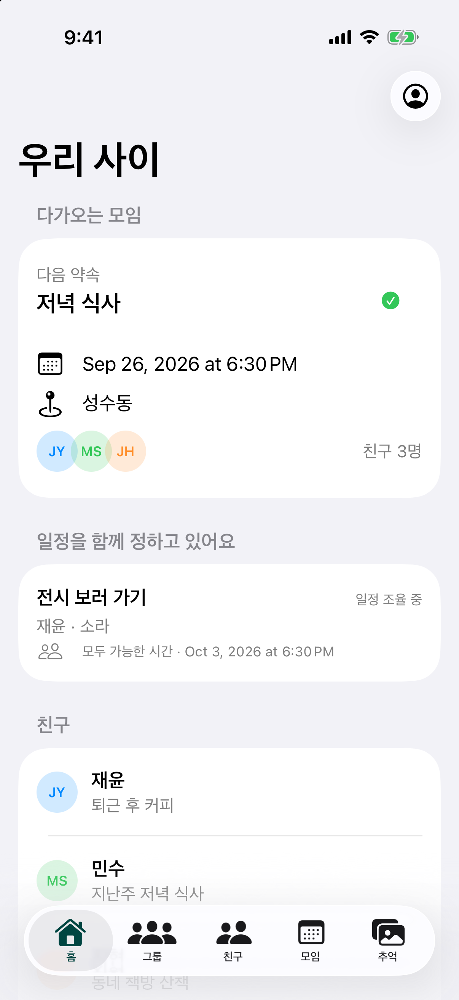
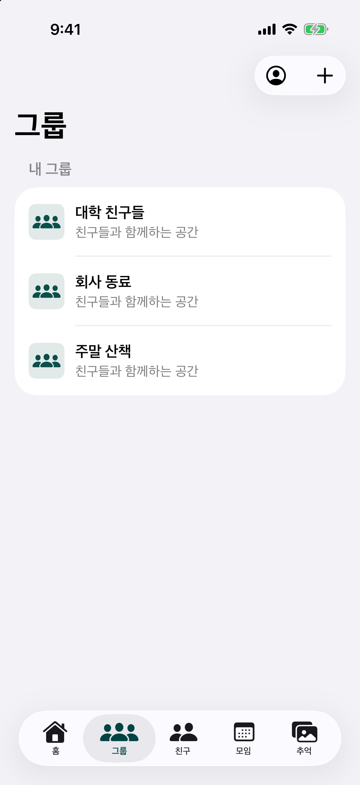
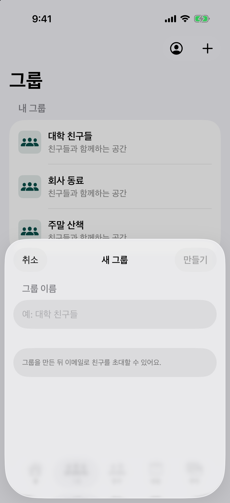
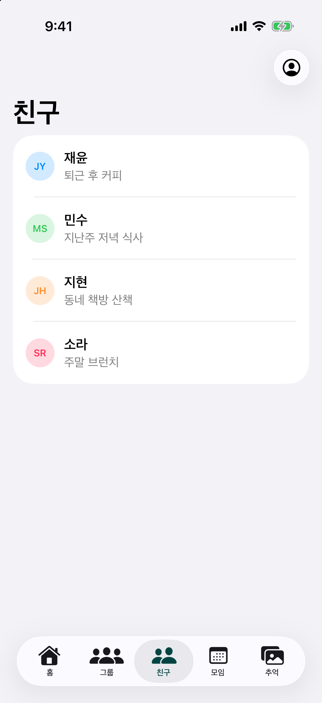
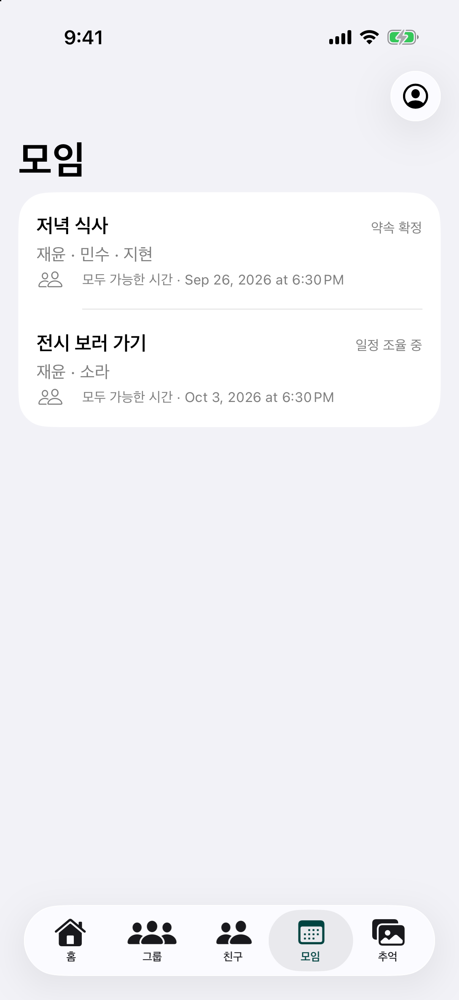
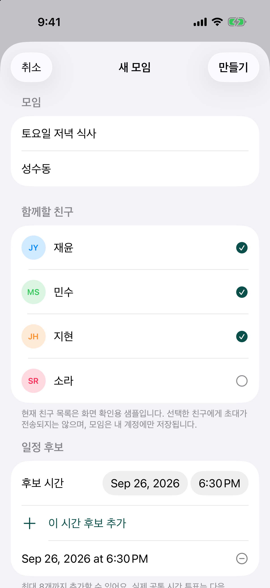

# 우리 사이

친구들과 약속을 정하고, 함께한 시간을 추억으로 남기는 프라이빗 관계 중심 iOS 앱입니다.

  

## 기획 이유

인스타그램이 친구 게시물보다 추천 콘텐츠와 광고, 유명 인플루언서의 전시를 소비하는 공간처럼 느껴질 수 있다는 문제의식에서 출발했습니다. 우리 사이는 공개적인 반응을 모으는 대신 실제로 아는 사람과 약속을 정하고 만나며, 함께한 순간을 다시 찾을 수 있게 돕습니다. 팔로워·좋아요 경쟁과 추천 피드는 제품 목표에서 제외합니다.

[기획 배경, 설계 원칙, MVP 범위 읽기](docs/product-rationale.md)

## 앱 화면

아래 화면은 Debug 미리보기에서 샘플 데이터로 캡처했습니다. 그룹 화면도 예시 그룹을 사용하며 Firebase 계정이나 서버 데이터를 변경하지 않습니다.

재캡처할 때는 Debug 스킴의 Launch Arguments에 `--screenshot-preview`와 `--screenshot-tab=home|groups|friends|meetups|memories`를 지정합니다. 그룹 생성 시트는 `--screenshot-group-create`, 모임 생성 시트는 `--screenshot-tab=meetups`와 `--screenshot-meetup-create`도 추가합니다.

<table>
  <tr>
    <td align="center"><strong>로그인</strong> </td>
    <td align="center"><strong>홈</strong> </td>
    <td align="center"><strong>그룹</strong> </td>
  </tr>
  <tr>
    <td align="center"><strong>그룹 만들기</strong> </td>
    <td align="center"><strong>친구</strong> </td>
    <td align="center"><strong>모임</strong> </td>
  </tr>
  <tr>
    <td align="center"><strong>모임 만들기</strong> </td>
    <td align="center"><strong>추억</strong> </td>
  </tr>
</table>

## 주요 흐름

- 친구와 여러 그룹을 만들고 이메일로 초대
- 계정에 모임을 만들고 친구와 후보 일정을 입력
- 모임을 홈과 모임 탭에서 이어서 확인
- 도착 상태를 공유하고 함께한 순간을 추억으로 정리
- 추천 피드, 팔로워 수, 좋아요 수를 중심에 두지 않는 관계 경험

## 기술 구성

- SwiftUI, iOS 17 이상
- Firebase Authentication
- Cloud Firestore

## 현재 구현 범위

Firebase 이메일 인증과 Firestore 그룹 생성·이메일 초대 및 계정별 모임 생성·조회가 연결되어 있습니다. 생성한 모임은 홈과 모임 탭에 표시됩니다. 현재 친구 목록은 샘플 데이터이므로 친구에게 초대나 투표가 전달되지는 않습니다. 공통 일정 투표, 도착 상태, 사진 업로드와 자동 추억 생성은 후속 MVP 작업입니다.

## 실행

1. `PrivateCircle.xcodeproj`를 Xcode에서 엽니다.
2. `PrivateCircle` 스킴과 iOS 시뮬레이터 또는 연결된 기기를 선택합니다.
3. 빌드 후 실행합니다.

Firebase 기능을 사용하려면 프로젝트에 맞는 `GoogleService-Info.plist`와 Firebase Console 설정이 필요합니다. 모임 저장 전 Firebase Console의 Firestore Rules에 저장소의 `firestore.rules`를 반영하고 게시해야 합니다.
