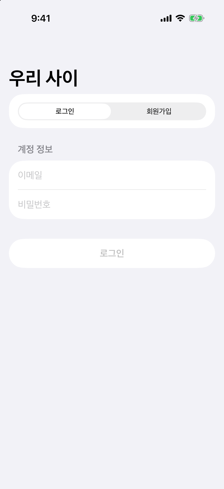
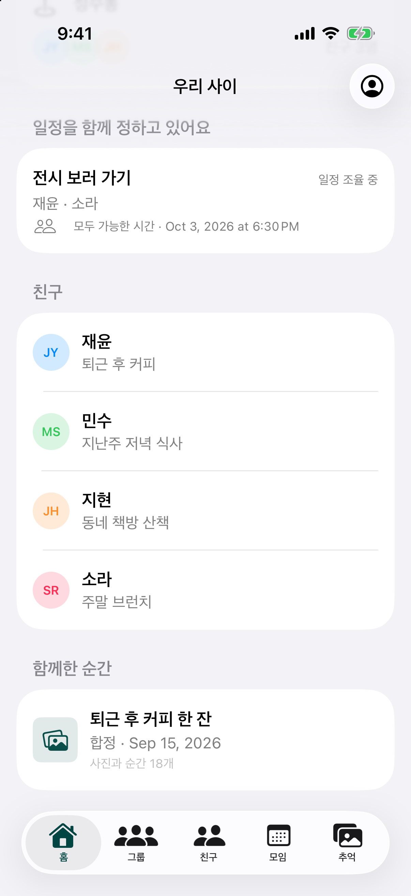

# 우리 사이

친구들과 약속을 정하고, 함께한 시간을 추억으로 남기는 프라이빗 관계 중심 iOS 앱입니다.

  

## 앱 화면

| 로그인 | 추억 |
| --- | --- |
|  |  |

## 주요 흐름

- 친구와 여러 그룹을 만들고 이메일로 초대
- 모임과 일정을 함께 조율
- 도착 상태를 공유하고 함께한 순간을 추억으로 정리
- 추천 피드, 팔로워 수, 좋아요 수를 중심에 두지 않는 관계 경험

## 기술 구성

- SwiftUI, iOS 17 이상
- Firebase Authentication
- Cloud Firestore

## 실행

1. `PrivateCircle.xcodeproj`를 Xcode에서 엽니다.
2. `PrivateCircle` 스킴과 iOS 시뮬레이터 또는 연결된 기기를 선택합니다.
3. 빌드 후 실행합니다.

Firebase 기능을 사용하려면 프로젝트에 맞는 `GoogleService-Info.plist`와 Firebase Console 설정이 필요합니다.
