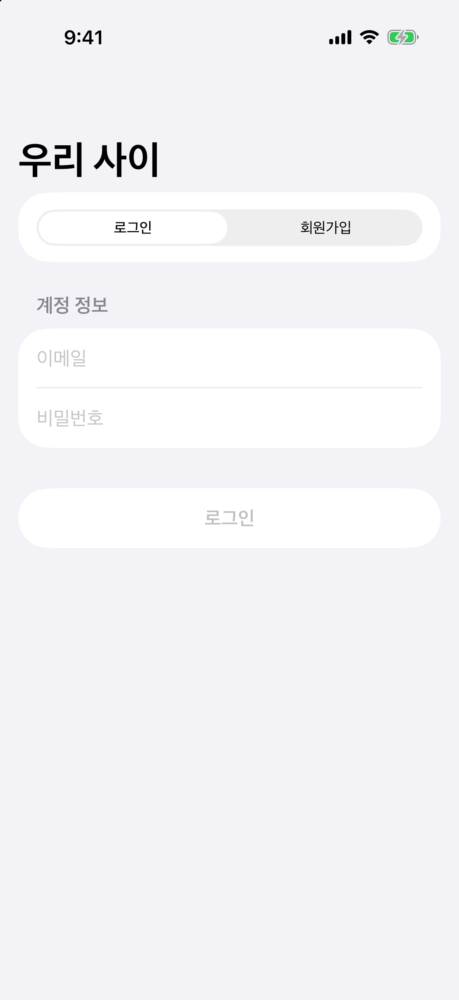
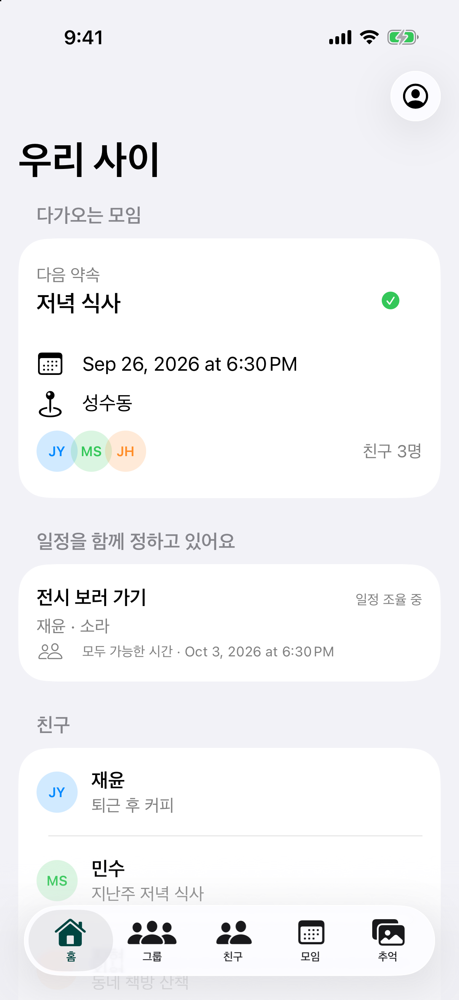
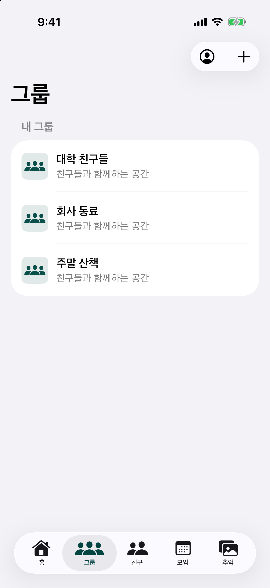
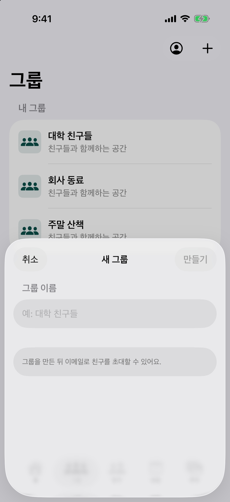
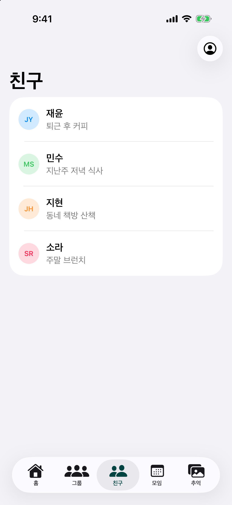
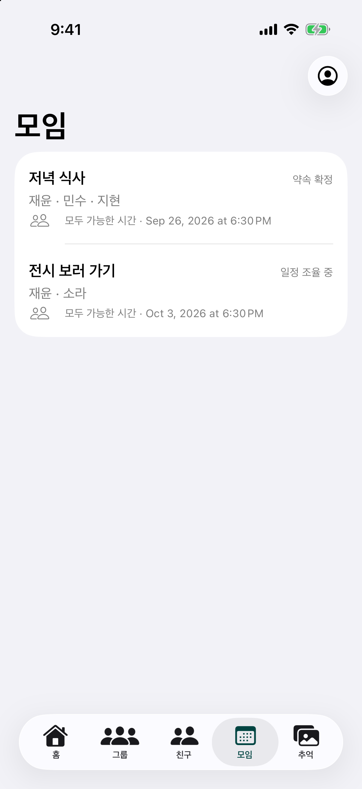
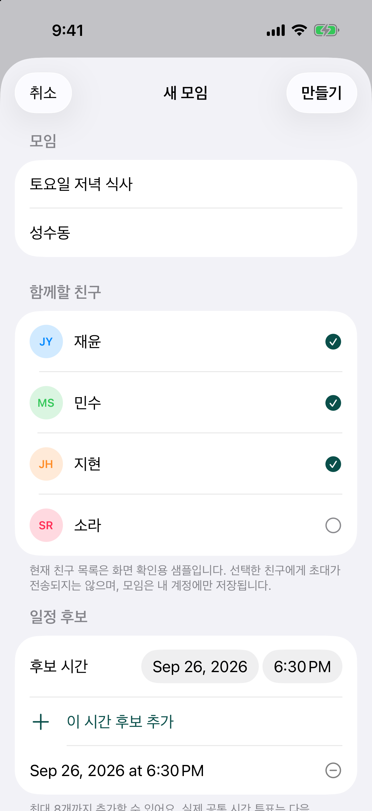
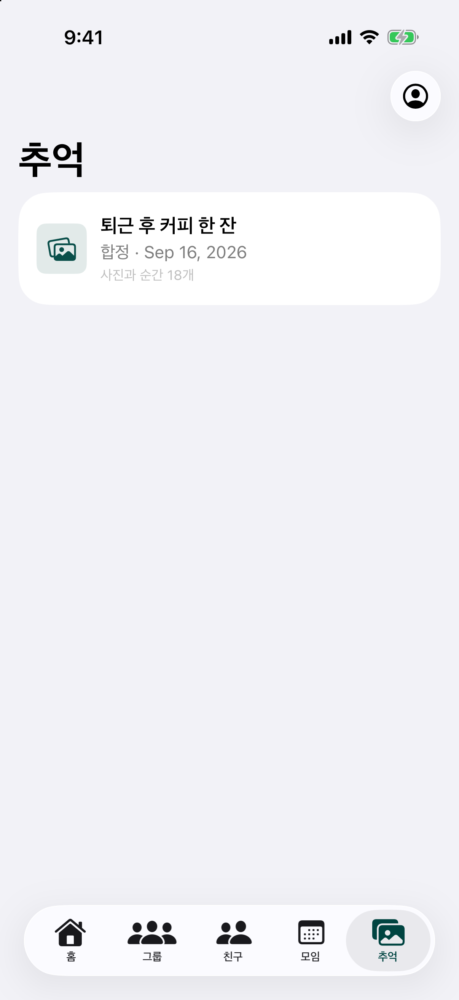

# 우리 사이

친구들과 약속을 정하고, 함께한 시간을 추억으로 남기는 프라이빗 관계 중심 iOS 앱입니다.

  

## 기획 이유

현재 대부분의 SNS가 친구와 소식을 나누는 기능을 넘어 추천 콘텐츠와 광고, 유명 인플루언서의 콘텐츠를 소비하는 공간으로 확장되고 있다는 문제의식에서 출발했습니다. 우리 사이는 공개적인 반응을 모으는 대신 실제로 아는 사람과 약속을 정하고 만나며, 함께한 순간을 다시 찾을 수 있게 돕습니다. 팔로워·좋아요 경쟁과 추천 피드는 제품 목표에서 제외합니다.

[기획 배경, 설계 원칙, MVP 범위 읽기](docs/product-rationale.md)

## 앱 화면

아래 화면은 Debug 미리보기에서 샘플 데이터로 캡처했습니다. 그룹 화면도 예시 그룹을 사용하며 Firebase 계정이나 서버 데이터를 변경하지 않습니다.

재캡처할 때는 Debug 스킴의 Launch Arguments에 `--screenshot-preview`와 `--screenshot-tab=home|groups|friends|meetups|memories`를 지정합니다. 그룹 생성 시트는 `--screenshot-group-create`, 모임 생성 시트는 `--screenshot-tab=meetups`와 `--screenshot-meetup-create`도 추가합니다.

<table>
  <tr>
    <td align="center"><strong>로그인</strong> </td>
    <td align="center"><strong>홈</strong> </td>
    <td align="center"><strong>그룹</strong> </td>
  </tr>
  <tr>
    <td align="center"><strong>그룹 만들기</strong> </td>
    <td align="center"><strong>친구</strong> </td>
    <td align="center"><strong>모임</strong> </td>
  </tr>
  <tr>
    <td align="center"><strong>모임 만들기</strong> </td>
    <td align="center"><strong>추억</strong> </td>
  </tr>
</table>

## 주요 흐름

- 친구와 여러 그룹을 만들고 이메일로 초대
- 그룹 멤버 중 참가자를 골라 모임과 일정 후보를 생성
- 참가자별 가능 시간을 저장하고 모임 화면에서 실시간으로 응답 확인
- 모임 만든 사람이 후보 시간을 최종 확정
- 추천 피드, 팔로워 수, 좋아요 수를 중심에 두지 않는 관계 경험

## 기술 구성

- SwiftUI, iOS 17 이상
- Firebase Authentication
- Cloud Firestore

## 현재 구현 범위

Firebase 이메일 인증과 Firestore 그룹 생성·이메일 초대, 참가자 선택형 공동 모임, 참가자별 일정 응답·실시간 동기화·작성자 일정 확정, 모임 당일 수동 도착 상태 공유가 구현되어 있습니다. Firestore Emulator 규칙 테스트 7개와 iOS Simulator Debug 빌드가 통과했습니다. 실제 Firebase 두 계정 확인, 운영 규칙 배포, 기존 공유 Meetup 참조 마이그레이션은 아직 필요합니다. GPS 추적은 하지 않습니다. 친구 목록과 추억은 실제 데이터에 연결되지 않았으며 공동 사진 업로드, 자동 추억, 알림, 계정 삭제와 출시 운영 기능은 후속 MVP 작업입니다.

## 실행

1. `PrivateCircle.xcodeproj`를 Xcode에서 엽니다.
2. `PrivateCircle` 스킴과 iOS 시뮬레이터 또는 연결된 기기를 선택합니다.
3. 빌드 후 실행합니다.

Firebase 기능을 사용하려면 프로젝트에 맞는 `GoogleService-Info.plist`와 Firebase Console 설정이 필요합니다. 공동 모임·응답·확정 흐름을 실제 계정에서 사용하기 전에 대상 Firebase 프로젝트를 확인한 뒤 `firestore.rules`를 게시하고, 기존 공유 Meetup의 참가자 참조를 마이그레이션해야 합니다. 저장소의 규칙이 운영 환경에 자동 배포되지는 않습니다. 규칙 테스트는 `npm run test:rules`로 실행합니다.
